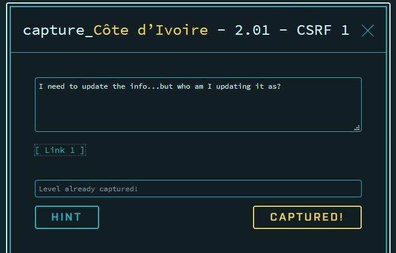
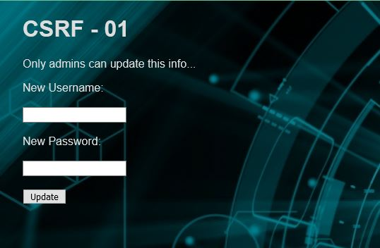
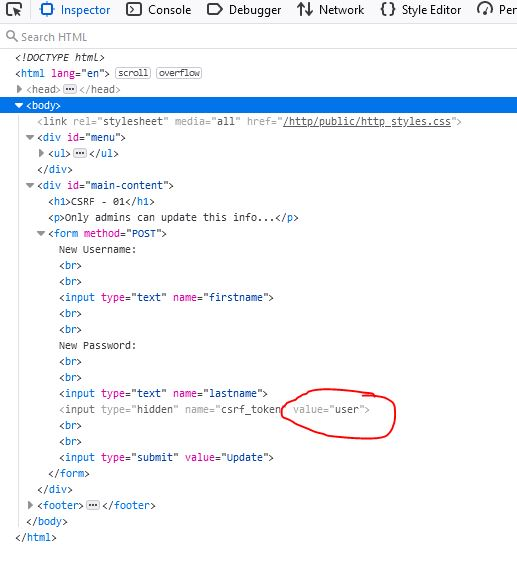
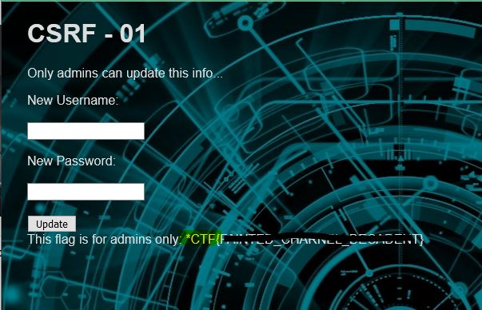
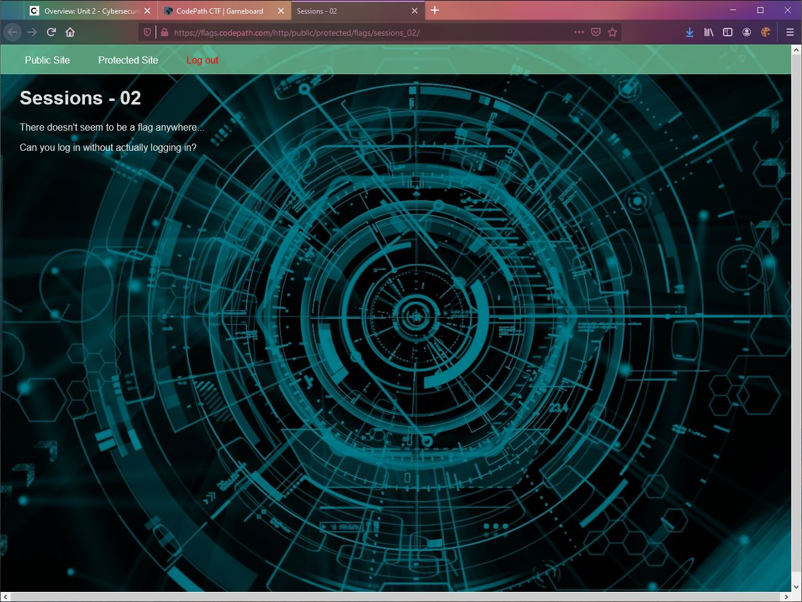
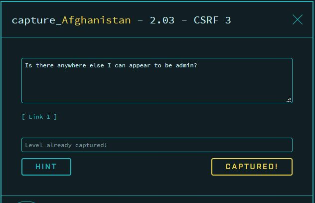
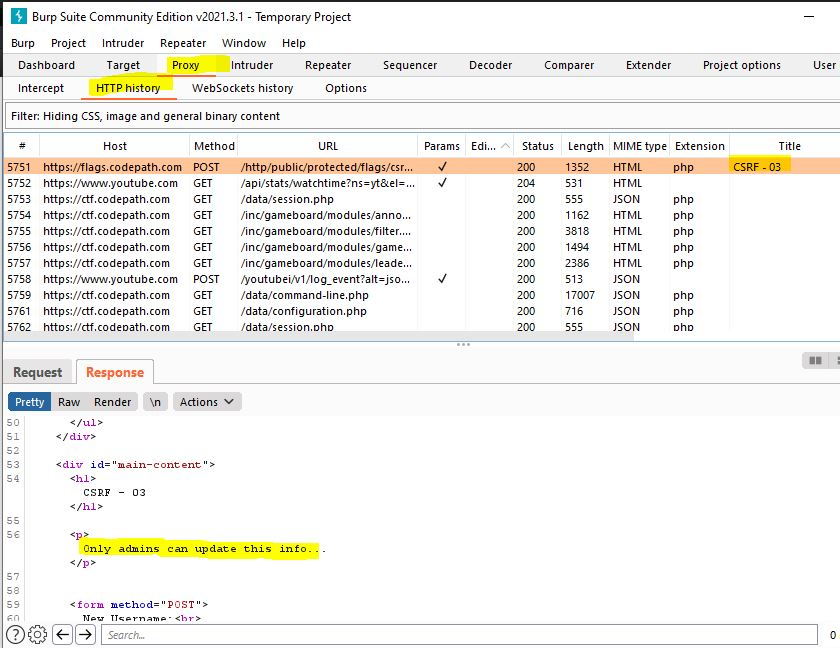
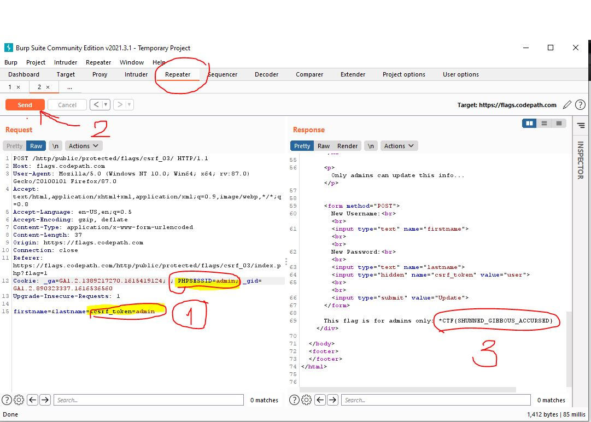
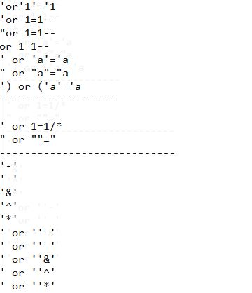
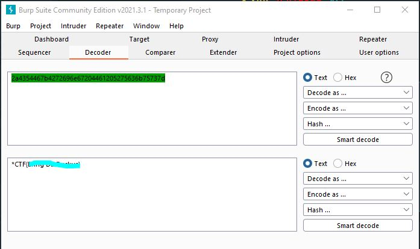

# CTF-WriteUp
***This is my CTF challenge practice for codepade class***

# **CTF WEEK1** 
- **1.01 Zimbabwe - Peculiar Employees**
  - 
   - Description
     - Sometimes it's not what you add but what you take away instead
   - Hind
   
- **1.02 Namibia - secre number1**
  -  
   - Description
     - Seems like there's a sequence to those numbers, wonder what would happen if you 
       used the next number in the sequence?
   - Hind

- **1.06 Indonesia**
  -  
   - Description
     - Three documents: first the riddle, then the answer, then the flag.
   - Hind
   
- **1.07 Canada - secret numer2** 

- 
   
   - Description
     - This challenge is looking for a secret number
     - A geometric number series this time, but with a twist at the end: the flag is encoded.
   - Hind
     - finding a number that keep ctf flag by using burp to get a number

- **1.04 Turkmenistan - Hidden user**
  -  
   - Description
     - Another number series? Some engineers love maths.
   - Hind
     - User on web page is not what we want.
     - look for user id. 
- **1.11 Egypt - Key player2**
  -  
   - Description
     - This time the developer was 'smart' and encoded the param values.
   - Hind
     - 
- **1.05 Chad - Odd list**
  -  
   - Description
     - One of these lists is not like the others.
   - Hind 
     - The List That Does Not Belong Contains The Answer You Seek
- **1.09 Nigeria - Secret Number 3**
  -  
   - Description
     - Here we have a famous number sequence (think: seashells) and an unlinked page with a clue.
   - Hind 
     - The number is not on a list.   
   
   
     
# **CTF WEEK2**

*Cookie and Session Based Attacks-The attackers can forge requests, 
steal cookies, and hijack browser sessions to gain access to privileged actions.*

 - **Cote d'Ivoire 2.01 - CSRF1**
   -   
   
   -  
   - Description
     - I need to update the info...but who am I updating it as?
     - Only admin can update this information..
   - Hind
     - First thing I should do is check on Inspector Element.
     - Right click on web page and choose Inspector Element.
     - look through a form and you will see csrf token value is 'user' but we need admin inorder to change.
     - Change user to admin and press update button to check if it work.
     - 
     - 
     - ***It's work!!!**

 - **Myanmar 2.11 - IDOR1**
   -  
   - Description
     - IDOR Flag 1
   - Hind
     - Do nothing with this one
     - Free flag showup 
 - **Iran 2.05 - CSRF5**
   -  
   - Description
     - Again with these methods!?
   - Hind
     - Need burp to find a flag (repeater tool)
     - change GET to POST Methods.
 - **Chile 2.13 - IDOR3**
   -  
   - Description
     - What id do I have to set to get a flag around here??
   - Hind
     - Use intruder tool in burp looking for id that will give a ctf flag.
 - **United States 2.09 - CSRF9**
   -  
   - Description
     - Fine, I'll just mostly do it myself
   - Hind
   
 - **Mexico 2.15 - Sessions2**
   -  
   - Description
     - The developer accidentally left a debugging tool available at https://flags.codepath.com/http/public/hacktools/change_session_id.php
   - Hind
     - use burp look for session id and use link that they provide to change it.
     - after session id change, flag will show on web app.
     - session id is from hind from session 1
     
 - **Venezuela 2.07 - CSRF7**
   -  
   - Description
     - To change or not to change
   - Hind
 
 - **Afghanistan 2.03 - CSRF3**
   -  
   - Description
     - Is there anywhere else I can appear to be admin?
   - Hind
     - I need to find a way to become an admin to update info....
     - go to Burp Suite
     -  
     - Go to 'reapeater' tool, cahnge csrf_token and session id  to admin
     - Press send to see response and check if we going to get ctf flag
     -  
 
  
# **CTF WEEK4**

*This week is about SQL Injection attacks by sending malicious input to a web application.*

 - **Thailand 4.02 - Painless**
   -  
    - Description
      - Seems like you are trailing behind and creating a space.
    - Hind
 - **Japan 4.06 - Alternative**
   -   
   -   
     - Description
       - They say 'when in doubt bet on wildcards.
     - Hind
       - open notepad
       - make a list of SQL Injection code and use burp(Intruder)to find it. 
       - or manual trype in one by one to force the web app show table of database that keep 'CTF Flag'
 - **Mongolia 4.08 -Gizmo**
   -  
    - Description
        - Déjà vu can feel so real it's WILD!
     - Hind
        
 - **Yemen 4.03 - Logic**
   -  
    - Description
      - Keep everything close and don't leave any spaces!
    - Hind 
 - **Kenya 4.05 -wild one**
    -  
   - Description
     - What's yoUR dream job type? I have aLways wanted to be a flag holder. 
     I hope my dream comes true.
   - Hind 
 - **France 4.04 - Censor**
   -  
   - Description
     - Have you read any interesting comments recently?
   - Hind  
 - **Spain 4.01 - Hello, SQLi**
   -  
   - Description
     - Sometimes the simplest answer is the true one.
   - Hind
  
  
# **CTF WEEK 5**
 - **Colombia 5.08 - Crypto/IDOR**
   -  
   - Description
     - The flag is encrypted with a cipher from the ancient world.
   - Hind
     - This challenge I need 2 step to finding a ctf flag answer
       - Use IDOR sloving concept form another week looking for user ID by using intruder in burp to get an id 
         that hiding ancient world and then it will show the ancient world that look like ctf format.
       - Decode ancient world to text by recommenced tool (http://rumkin.com/tools/cipher/atbash.php)
     
 - **Brazil 5.07 - PROTECK YA NECK**
   -  
   - Description
     - The base64-encoded content in the attached file has been encrypted via AES
     - CLUsFeOpcKy9qzeyuqVEuGJwIV9CZep3p/SeqKaQ9JXfl6PEpEE7gInM+mOfdtUi
   - Hind
     - open attack file. 
     - Key is a "PROTECK YA NECK"
     - use an online tool to decrypt it with a key.
     
 - **Congo-Brazzaville 5.03 - Fixed XOR1**
   - Description
     - *CTF{value} where 'value' is the XOR of the following two strings (excluding quotes): 
       '42696c6c792c20646f6e27' and '742062652061206865726f'*
   - Hind
     - This challenge give us two string 
  
  
 - **Azerbaijan 5.01 -Decode the flag 1**   
   - Description
     - KkNURntraWxsaW5nIHlvdXIgYnJhaW4gbGlrZSBhIHBvaXNvbm91cyBtdXNocm9vbX0=
   - Hind
     - This string is give a format of base64.
     - First thing I would try to do is to decode it by using burp suite.
     - This is a stretch challenge and use a decoder tool in burp to decode it.
     -   
     
     
 - **Central African Republic 5.02 - Decode the flag 2**
   - Description
     - 2a4354467b4272696e67204461205275636b75737d
   - Hind
     - This string is give me a ASCII format 
     - Nothing looks complicate for me to just try decoding it.
     - Recommend decoding tool in Burp Suite.
     -  

